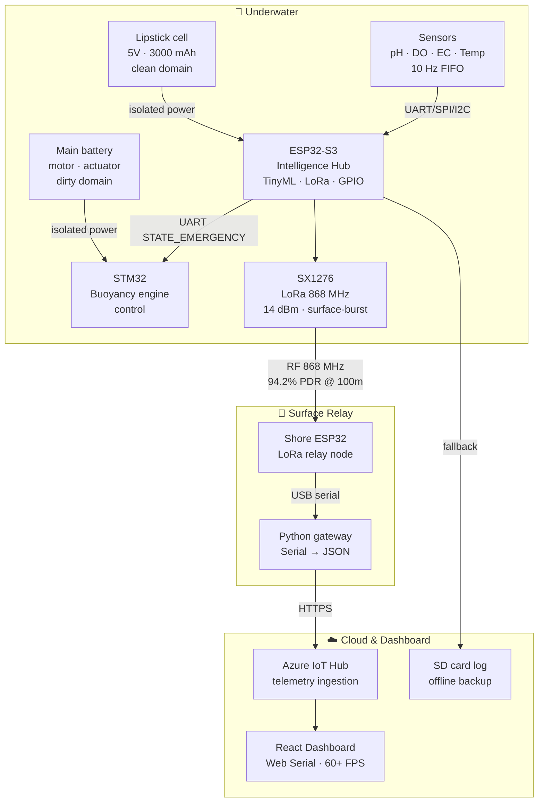
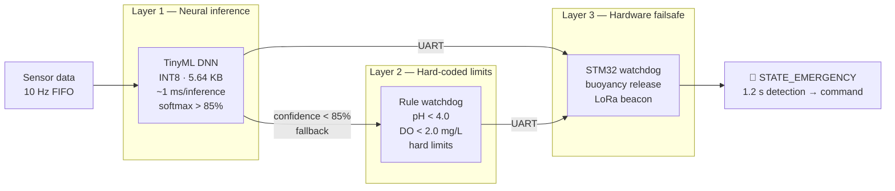
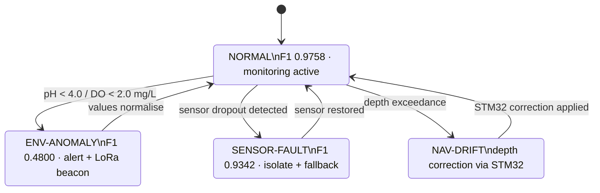

# 🌊 Autonomous Submarine Glider — Edge AI & Telemetry Stack

> **Lake Victoria Water Quality Monitor** — Autonomous underwater glider with on-board TinyML anomaly detection, dual-ESP32 LoRa telemetry bridge, and real-time Azure IoT dashboard. Built for freshwater conditions where satellite telemetry fails and cloud inference is impractical.

**My role:** Lead — Intelligence & Communication Layers (ESP32 firmware, TinyML pipeline, LoRa bridge, Azure dashboard)  
**Team:** 3 members · STM32 control/hardware by teammate · KCL MSc Capstone · **Individual Distinction**

---

## System Architecture



---

## 3-Layer Safety Chain



> No single point of failure — each layer is an independent failure domain.

---

## TinyML State Machine



---

## What I Built

```
[ESP32-S3 Intelligence Hub]
    ├── 4× water quality probes (pH, DO, EC, Temp) @ 10 Hz → circular FIFO
    ├── TinyML DNN (30→32→16→4) — INT8 post-training quantisation
    │     ├── 22.56 KB → 5.64 KB (4× compression), ~1 ms/inference
    │     └── Classes: NORMAL / ENV-ANOMALY / SENSOR-FAULT / NAV-DRIFT
    ├── Rule-based watchdog (fallback when softmax confidence < 85%)
    │     └── Hard limits: pH < 4.0, DO < 2.0 mg/L
    └── STATE_EMERGENCY → STM32 via UART → buoyancy release + LoRa beacon

[Dual-ESP32 LoRa Bridge]
    ├── Submerged node (SX1276, 868 MHz, 14 dBm)
    ├── Surface-burst strategy: transmit only above 0.2 m depth
    ├── Shore relay → Serial-to-USB → Python gateway
    └── Microsoft Azure IoT Hub → React/TypeScript dashboard (60+ FPS)

[Dual-Battery Isolation]
    ├── Main pack → actuator + motor (dirty domain)
    └── Lipstick cell (5V, 3000 mAh) → ESP32 + LoRa + sensors (clean domain)
          ~48h operating time under duty-cycled inference
```

---

## Performance

| Metric | Value |
|--------|-------|
| TinyML model size (INT8) | **5.64 KB** |
| Test accuracy | **96.03%** |
| Macro F1 | **0.7967** |
| Inference latency | **~1 ms** |
| LoRa PDR @ 100 m | **94.2%** |
| Average RSSI (submerged) | **−105 dBm** |
| Anomaly → STATE_EMERGENCY | **1.2 s** |
| End-to-end → Azure dashboard | **1.85 s** |
| Logic layer operating time | **~48 h** |

---

## Why These Design Decisions

**LoRa over satellite** — Persistent tropical cloud cover degrades satellite reliability over Lake Victoria. LoRa at 868 MHz is cost-independent and cloud-independent. In freshwater at 1–2 m depth, RF attenuation is low enough for surface-burst transmission — no full surface breach needed.

**TinyML on-device over cloud inference** — AUVs face extreme data scarcity and power constraints. INT8 quantisation shrinks the model 4× with 3× inference speedup and minimal accuracy loss. Transmitting raw sensor streams to cloud is incompatible with a 48h battery budget.

**Hybrid fallback (TinyML + rule-based watchdog)** — Pure TinyML risks false-negatives under INT8 precision limits (FMEA RPN 160). Pure rule-based misses complex multi-sensor patterns. The hybrid distributes failure domains: neither layer alone can silence the emergency path.

**Galvanic isolation** — Propulsion EMI contaminates analog sensor readings. Separate power domains prevent fault propagation from the intelligence layer to vehicle control.

---

## Technical Stack

| Layer | Tech |
|-------|------|
| Edge AI | TFLite Micro (ESP32-S3), INT8 post-training quantisation, 30-32-16-4 DNN |
| Training | InWaterSense + AUV navigation dataset, custom augmentation, 80-epoch convergence |
| Communication | SX1276 LoRa 868 MHz, dual-ESP32 bridge, custom packet protocol |
| Cloud | Microsoft Azure IoT Hub, Python gateway |
| Firmware | ESP32-S3, STM32 (bare-metal C, UART/SPI/I2C) |
| Dashboard | React/TypeScript, Web Serial API, 60+ FPS real-time visualisation |

---

## Repository Structure

```
submarine_dev/
├── simulation/          # Glider trajectory & gateway simulations
├── lora_base_station/   # Shore relay sketch (ESP32)
├── tflite_test/         # TFLite Micro inference validation
└── training/            # Model training, INT8 quantisation, export

submarine-test/          # STM32CubeIDE firmware (teammate — buoyancy control)
```

---

## Assessment

**Individual Distinction** · KCL MSc Robotics Capstone 2026

| Criterion | Score |
|-----------|-------|
| Project impact | 70 |
| Communication | 70 |
| Project management | 75 |
| Sustainability | 75 |
| LCA | 70 |
| FMEA | 70 |
